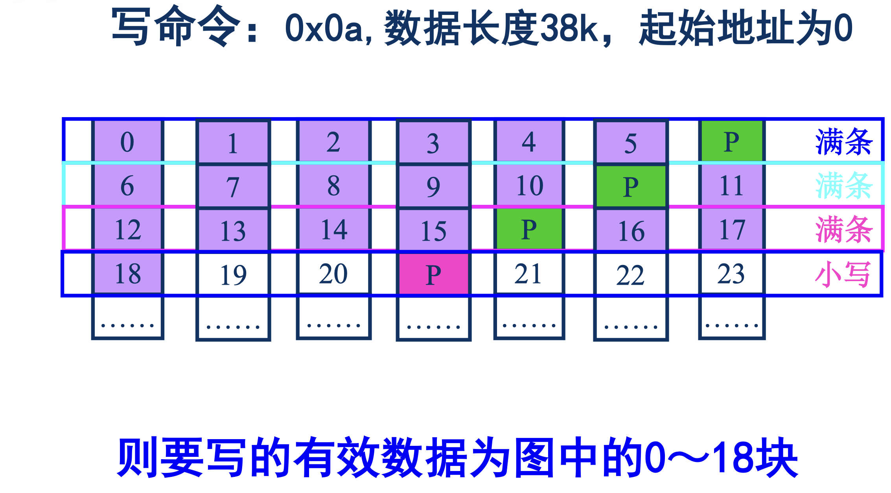
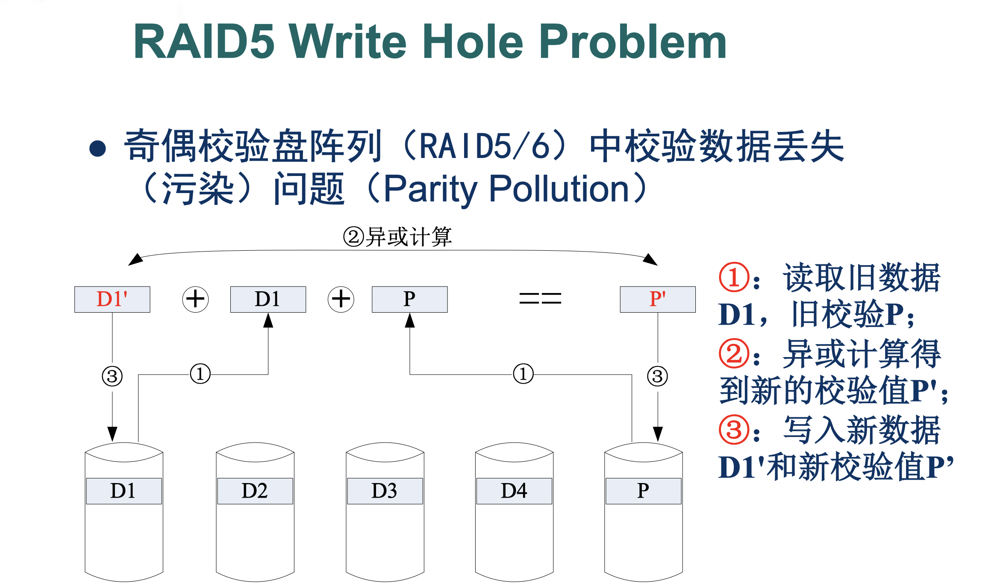
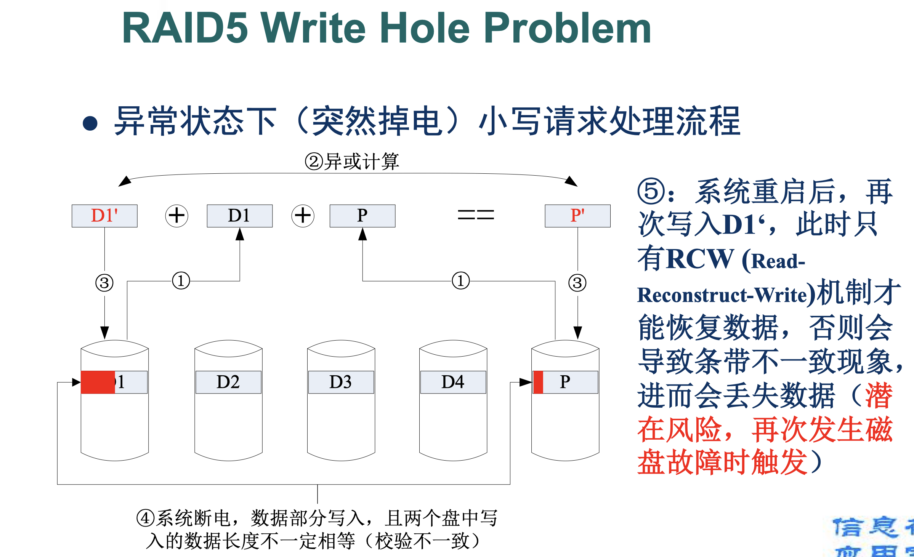
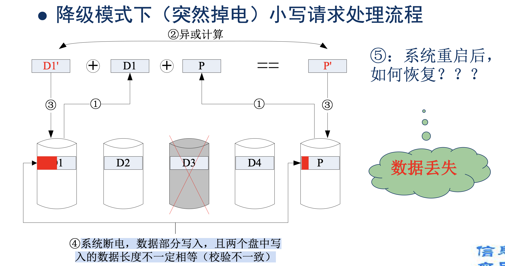

+++
date = '2024-11-11T20:56:59+08:00'
draft = false
title = 'RAID_study'
+++

# **RAID学习**

## RAID-0

## RAID-1

## RAID-2

## RAID-5

写合并情况：

小写的过程需要RMW，同时不仅需要读写18号数据块，同时也需要读写校验块p。

小写请求的处理步骤通常是：

1. **读取旧数据块和校验块**
2. **根据新数据计算新的校验块** 。
3. **写入新数据块和新的校验块**

### **异常状态的风险**

* 如果系统在步骤 3（写入新数据和校验块）时突然掉电：
  * 数据块可能已经写入，但校验块未写入。
  * 或校验块写入完成，但数据块未写入。
* 结果是，条带中的数据和校验块不一致，称为  **条带不一致（Stripe Inconsistency）** 。

在这种情况下(小写请求)，如果稍后发生磁盘故障，系统将无法正确重建丢失的数据，从而导致数据丢失。

### RCW机制：

**RCW（Read-Reconstruct-Write）** 是一种防止条带不一致的机制，适用于小写请求。在写入过程中，RCW 不仅依赖数据块和校验块的部分更新，还会重新构建整个条带，以确保数据和校验块的一致性

#### **RCW 的具体流程**

假设写请求更新条带中的数据块 D1D1**D**1 为 D1′D1'**D**1**′**，RCW 机制处理流程如下：

1. **读取整个条带（Read Full Stripe）** :

* 包括所有数据块（如 D1,D2,D3D1, D2, D3**D**1**,**D**2**,**D**3）和校验块（PP**P**）。
* 确保内存中有条带的完整内容。

2. **重建校验块（Reconstruct Parity）** :

* 根据条带中的所有数据块（包括更新后的 D1′D1'**D**1**′**）重新计算校验块 P′P'**P**′。

    3.**写回条带（Write Full Stripe）** :

* 将整个条带的内容（D1′,D2,D3,P′D1', D2, D3, P'**D**1**′**,**D**2**,**D**3**,**P**′）写回到磁盘，而不是仅更新部分数据块和校验块。

#### **RCW 的优点**

* **一致性保障** ：条带内的数据和校验块始终保持一致，即使写入中途发生掉电，也能通过冗余数据恢复。
* **数据可靠性** ：如果发生磁盘故障，仍然可以通过剩余数据块和校验块正确重建丢失的数据。

---

#### **为什么 RCW 机制是必要的？**

在 RAID 5 中，小写请求容易导致以下问题：

#####  **条带不一致**

* 如果仅部分更新数据块或校验块，系统无法正确区分哪些数据是旧数据，哪些数据是新数据。
* 例如，在写入 D1′D1'**D**1**′** 和 P′P'**P**′ 的过程中突然掉电：##### 若 D1′D1'**D**1**′** 写入成功，但 P′P'**P**′ 未写入，校验块与条带数据不一致。后续重建数据时，会使用错误的校验块，导致数据恢复失败。

##### 数据丢失风险

如果在条带不一致的情况下再次发生磁盘故障，系统将丢失无法恢复的数据。

##### **RCW 的预防作用**

RCW 通过重建并写回整个条带，确保写操作完成后条带的数据和校验块是一致的，从而消除潜在的风险。

### 降级模式&重建过程

即一个磁盘故障后，阵列继续工作。

如果突然掉电发生小写请求，处理流程会变得更复杂，主要因为：

1. 某个磁盘已经不可用。
2. RAID 必须通过剩余的数据块和校验块动态重建丢失的数据。
3. 系统掉电后可能会导致数据和校验块不一致。

具体的恢复流程如下（掉电后也如此）：

1. **读取日志信息** :

* RAID 控制器从日志中获取掉电前的写请求信息，包括目标条带、起始位置和数据块。
* 如果写日志可用，则优先使用日志数据完成恢复。

2. **重建故障磁盘上的数据** :

* RAID 使用剩余的数据块和校验块，动态计算丢失的块：
  所谓使用剩余的数据块和校验块就是读取除了那块坏盘之外剩余的所有数据块（该条带上）

3. **重新校验和写入校验块** :

* RAID 根据重建后的数据块和新写入数据块，重新计算校验块并更新磁盘。
  写入坏掉的需要重新构建的数据块和校验块

4. **恢复故障磁盘** :

* 如果替换了故障磁盘，RAID 开始重建整个磁盘数据。

### 校验信息的正确完整性问题，初始化过程

满条块写和大写(RCW)可以保证校验信息的正确性。若原始校验信息不正确，则小写不能保证校验信息的正确。因为小写操作依赖于条带中现有的校验信息和数据块的一致性依据。错误的校验信息进行重建得出的数据也是不正确的， 所以需要初始化过程。
